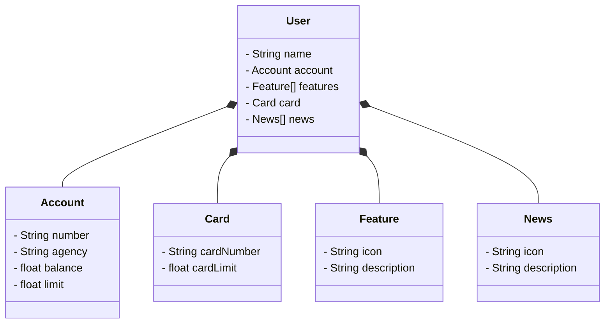

#API Restfull with Spirng Boot

## Diagrama de Classes

```mermaid
classDiagram

class User {
  - String name
  - Account account
  - Feature[] features
  - Card card
  - News[] news
}

class Account {
  - String number
  - String agency
  - float balance
  - float limit
}

class Feature {
  - String icon
  - String description
}

class Card {
  - String cardNumber
  - float cardLimit
}

class News {
  - String icon
  - String description
}

User *-- Account
User *-- Card
User *-- Feature
User *-- News
```
